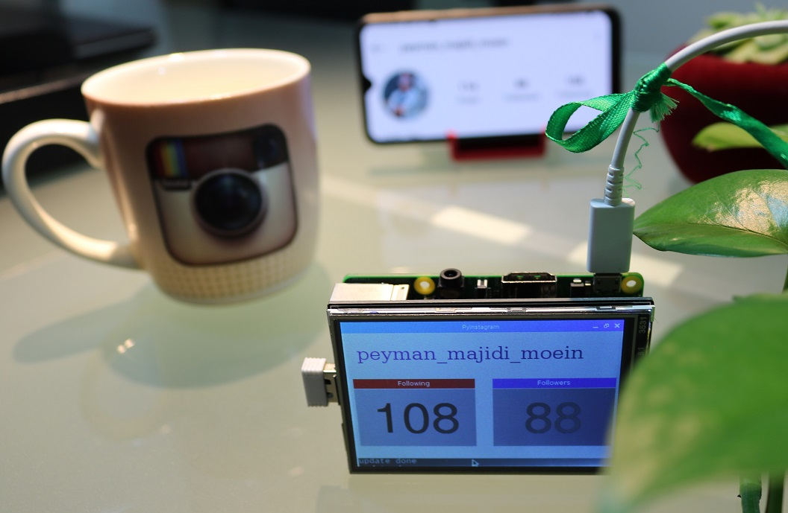

# PyInsta
Python Tutorial - Work with the Internal Instagram API, build a InstaFlower counter device(using Raspberry pi)

In this tutorial under the pretext of training Python, we connect to Instagram and fetch the number of followers and following and display them in a simplified & fun device. Fetching every 5 seconds ... trying to enjoy programming while in practical training.

Watch full traing video on aparat:
[Watch Video](https://www.aparat.com/v/Wbs5w)


```python
        r = requests.get(f"https://www.instagram.com/{username}/?__a=1").json()
        followers = r['graphql']['user']['edge_followed_by']['count']
        following = r['graphql']['user']['edge_follow']['count']
        posts = r['graphql']['user']['edge_owner_to_timeline_media']['count']
        return followers, following, posts
```
Screenshot:


A picture of final project:

